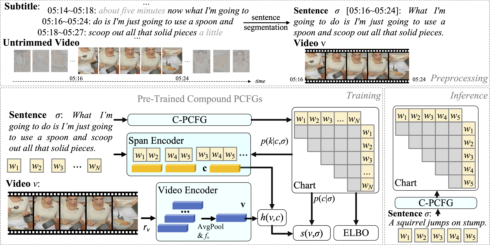

# Learning a Grammar Inducer by Watching Millions of Instructional YouTube Videos

> [**Learning a Grammar Inducer by Watching Millions of Instructional YouTube Videos**](https://arxiv.org/pdf/2210.12309.pdf)<br>
> accepted by EMNLP 2022 as an oral presentation<br>
> [Songyang Zhang](https://sy-zhang.github.io/), [Linfeng Song](https://freesunshine0316.github.io/), [Lifeng Jin](https://lifengjin.github.io/), [Haitao Mi](https://scholar.google.com/citations?user=G3OMbFSm858C&hl=tl), [Kun Xu](https://sites.google.com/view/kunxu/home), [Dong Yu](https://sites.google.com/view/dongyu888/) and [Jiebo Luo](https://www.cs.rochester.edu/u/jluo/).

Video-aided grammar induction aims to leverage video information for finding more accurate syntactic grammars for accompanying
text. While [previous work](https://github.com/Sy-Zhang/MMC-PCFG) focuses on building systems on well-aligned video-text pairs, we train our model only on noisy YouTube videos without finetuning on benchmark data and achieved stronger performances across three benchmarks.

[[arxiv]](https://arxiv.org/pdf/2210.12309.pdf)

## News
- **[Oct, 2022]** Talk invited by [UM-IoS EMNLP 2022 Workshop](https://induction-of-structure.github.io/emnlp2022/) :smile:
- **[Oct, 2022]** Our paper has been accepted by EMNLP 2022 (**Oral**). :sparkles: 

## Approach



## Requirements
We provide Docker image for easier reproduction. Please install the following:
  - [nvidia driver](https://docs.nvidia.com/cuda/cuda-installation-guide-linux/index.html#package-manager-installation) (418+), 
  - [Docker](https://docs.docker.com/install/linux/docker-ce/ubuntu/) (19.03+), 
  - [nvidia-container-toolkit](https://github.com/NVIDIA/nvidia-docker#quickstart).

We only support Linux with NVIDIA GPUs. We test on Ubuntu 18.04 and V100 cards.

## Quick Start

### Launch Docker Container
```bash
CUDA_VISIBLE_DEVICES=0,1 source launch_container.sh $PATH_TO_STORAGE/data $PATH_TO_STORAGE/checkpoints $PATH_TO_STORAGE/log
```
The launch script respects $CUDA_VISIBLE_DEVICES environment variable.
Note that the source code is mounted into the container under `/src` instead 
of built into the image so that user modification will be reflected without
re-building the image.

### Data Preparation
Please download the preprocessed data from [here](https://www.dropbox.com/sh/flshflx1rdrxh8v/AAAktPEWL1iHde0wU20aVlwGa?dl=0) to `data`, 
 and [here](https://www.dropbox.com/sh/mjha0m8onhkerxm/AADZmVbXWRVwwg9__f6O98sYa?dl=0) to `.cache`.
 
 [Optional] You can also preprocess data from raw captions. Details are described [here](#preprocessing-details). 

### Training

Run the following commands for training:
```bash
sh scripts/train.sh
```

### Evaluation
Our trained model are provided [here](https://www.dropbox.com/sh/jjp48bmr8tj283e/AAArbHSQsZQzbNR_TCKN8QIga?dl=0). Please download them to `checkpoints`.
Then, run the following commands for evaluation:
```bash
sh scripts/test.sh
```
### Preprocessing details
We preprocess subtitles with the following scripts:
```bash
python tools/preprocess_captions.py
python tools/compute_gold_trees.py
python tools/generate_vocabularies.py
```

## Citation
If this project is useful for you, please consider citing our paper :mega:
```
@inproceedings{zhang2022training,
title={Learning a Grammar Inducer by Watching Millions of Instructional YouTube Videos},
author={Zhang, Songyang and Song, Linfeng and Jin, Lifeng and Mi, Haitao and Xu, Kun and Yu, Dong and Luo, Jiebo},
booktitle={EMNLP},
year={2022}
```

## Acknowledgements

This repo is developed based on [VPCFG](https://github.com/zhaoyanpeng/vpcfg), [MMC-PCFG](https://github.com/Sy-Zhang/MMC-PCFG) and [Punctuator2](https://github.com/ottokart/punctuator2).


